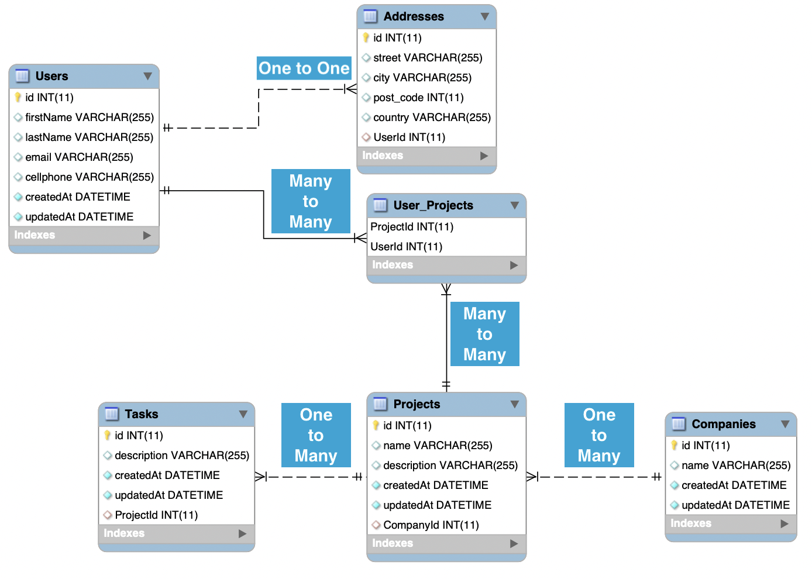

# Project for training of technologies in Node, Express and Sequelize.

This is an academic project, written for Systems Analysts, Project Manager, Software Engineer and Hackers. Its main purpose is to provide technical training using the most common hackend technologies available for the programming language coded in NodeJS.

### What are we using?

Service | Description 
--- | ---
*Http Server* | We will use [Express](https://expressjs.com/) for web management, as it is a minimalist and fast structure library for [NodeJS](https://nodejs.org/en/).
*Database* | [MySQL](http://mysql.com): We will use it to manage our database.
*ORM* | [Sequelize](https://sequelize.org/): We will use it to connect to the database, provide us with an ORM for the main databases, offering support transactions, relationships in a quick and easy way.

### Training requirements
Description | Active version
--- | ---
Node | v14.16.1
Express | 4.16.1
MySQL | 10.4.11-MariaDB

## Challenge

We will demonstrate the functioning of relationships, associating tables and applying: One to One, One to Many, Many to Many. All of this, using the best of sequelize-cli in its operation and integrated with Express for some examples.

## How to run the project?

`sudo npm install -g express-generator`

`sudo npm install sequelize-cli -g`
